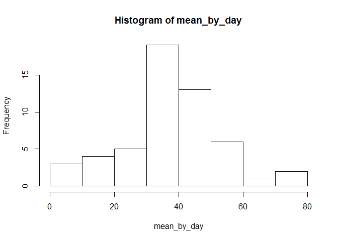
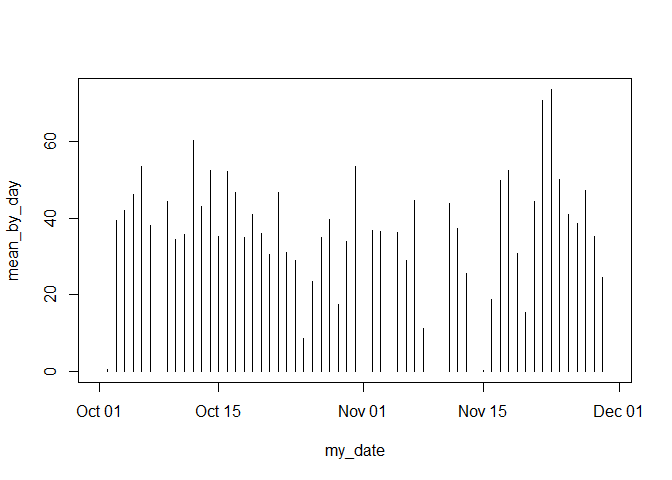
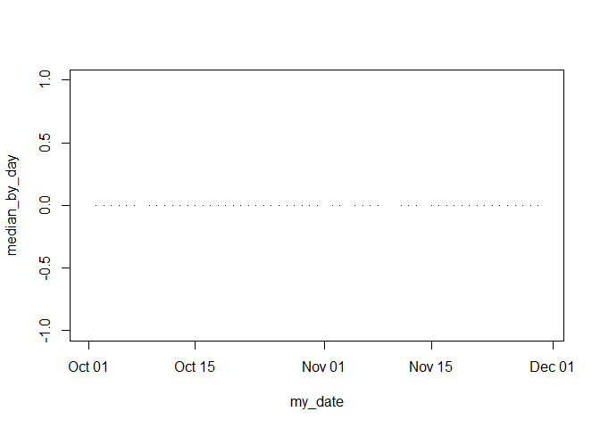
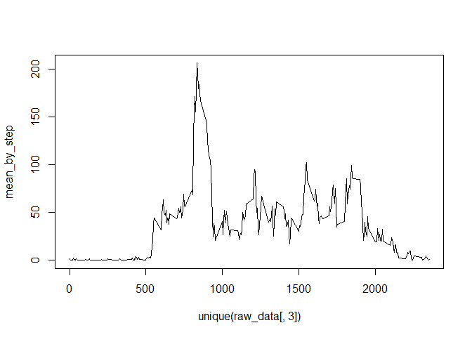

## Loading and preprocessing the data

In this part the raw data are imported to the R code. The data is in a .csv format in the acivity.csv file.


```r
raw_data <- read.csv(file='./activity/activity.csv')
head(raw_data)
```

```
##   steps       date interval
## 1    NA 2012-10-01        0
## 2    NA 2012-10-01        5
## 3    NA 2012-10-01       10
## 4    NA 2012-10-01       15
## 5    NA 2012-10-01       20
## 6    NA 2012-10-01       25
```

```r
mean(raw_data[,1], na.rm=TRUE)
```

```
## [1] 37.3826
```

```r
summary(raw_data)
```

```
##      steps                date          interval     
##  Min.   :  0.00   2012-10-01:  288   Min.   :   0.0  
##  1st Qu.:  0.00   2012-10-02:  288   1st Qu.: 588.8  
##  Median :  0.00   2012-10-03:  288   Median :1177.5  
##  Mean   : 37.38   2012-10-04:  288   Mean   :1177.5  
##  3rd Qu.: 12.00   2012-10-05:  288   3rd Qu.:1766.2  
##  Max.   :806.00   2012-10-06:  288   Max.   :2355.0  
##  NA's   :2304     (Other)   :15840
```

## What is mean total number of steps taken per day?
No we need to calculate the number of steps taken at each day.


```r
#lapply()
mean_by_day <- tapply(raw_data[,1], raw_data[,2], mean, na.rm=TRUE)
median_by_day <- tapply(raw_data[,1], raw_data[,2], median, na.rm=TRUE)
head(mean_by_day)
```

```
## 2012-10-01 2012-10-02 2012-10-03 2012-10-04 2012-10-05 2012-10-06 
##        NaN    0.43750   39.41667   42.06944   46.15972   53.54167
```

```r
summary(mean_by_day)
```

```
##    Min. 1st Qu.  Median    Mean 3rd Qu.    Max.    NA's 
##  0.1424 30.6979 37.3785 37.3826 46.1597 73.5903       8
```

```r
hist(mean_by_day)
```

<!-- -->

```r
my_date <- unique(as.Date(raw_data[,2], fomrat = "%Y-%m-%d"))
dur_days <- max(my_date) - min(my_date)
dur_days
```

```
## Time difference of 60 days
```

```r
plot(my_date, mean_by_day, 'h')
```

<!-- -->

```r
plot(my_date, median_by_day, 'h')
```

<!-- -->
The mean steps taken per day is : **NaN, 0.4375, 39.4166667, 42.0694444, 46.1597222, 53.5416667, 38.2465278, NaN, 44.4826389, 34.375, 35.7777778, 60.3541667, 43.1458333, 52.4236111, 35.2048611, 52.375, 46.7083333, 34.9166667, 41.0729167, 36.09375, 30.6284722, 46.7361111, 30.9652778, 29.0104167, 8.6527778, 23.5347222, 35.1354167, 39.7847222, 17.4236111, 34.09375, 53.5208333, NaN, 36.8055556, 36.7048611, NaN, 36.2465278, 28.9375, 44.7326389, 11.1770833, NaN, NaN, 43.7777778, 37.3784722, 25.4722222, NaN, 0.1423611, 18.8923611, 49.7881944, 52.4652778, 30.6979167, 15.5277778, 44.3993056, 70.9270833, 73.5902778, 50.2708333, 41.0902778, 38.7569444, 47.3819444, 35.3576389, 24.46875, NaN** steps
The median steps taken per day is : **NA, 0, 0, 0, 0, 0, 0, NA, 0, 0, 0, 0, 0, 0, 0, 0, 0, 0, 0, 0, 0, 0, 0, 0, 0, 0, 0, 0, 0, 0, 0, NA, 0, 0, NA, 0, 0, 0, 0, NA, NA, 0, 0, 0, NA, 0, 0, 0, 0, 0, 0, 0, 0, 0, 0, 0, 0, 0, 0, 0, NA** steps


## What is the average daily activity pattern?


```r
mean_by_step <- tapply(raw_data[,1], raw_data[,3], mean, na.rm=TRUE)

plot(unique(raw_data[,3]), mean_by_step, type = 'l')
```

<!-- -->

```r
step_max <- max(mean_by_step)
step_max_indx <- which.max(mean_by_step)
inter_max <- raw_data[step_max_indx,3]
max_hour <- floor(inter_max/60)
max_min <- inter_max %% 60
# step_max
```

As it can be seen from the figure above, on average the maxmim steps of  **206.17** steps is taken at **835** minute in a 5-minute interval which corresponds to the time **13:55**. It shows that the peak activity happens at this time of the day.

## Imputing missing values


## Are there differences in activity patterns between weekdays and weekends?
